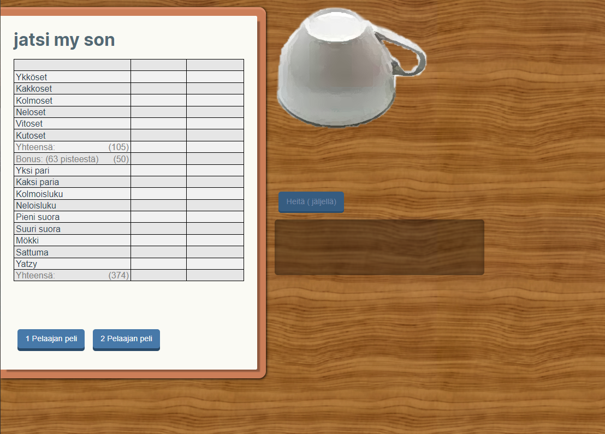

[](https://app.netlify.com/sites/admiring-heisenberg-be714c/deploys)
# yatzy

  

### Suomenkielinen yatzy peli

  

  

Pelaa [täällä](https://yatzy.pennanen.dev/).

  



  

## TODO:

  

- [X] Mahdollisuus keskeyttää peli

- [X] Pikanäppäimet pelin toiminnoille 
- [] Ohjeet
- [ ] Pisteiden tallennus / Parhaat pisteet

- [ ] Visuaalinen palaute pelin voittajasta / Pisteiden korostaminen

- [ ] Äänitehosteet

  

## Ympäristön asennus

  

```bash

  

npm install

  

```

  

  

### Dev ympäristön käynnistys

  

```bash

  

npm run serve

  

```

  

  

### Kokoa projekti

  

```bash

  

npm run build

  

```